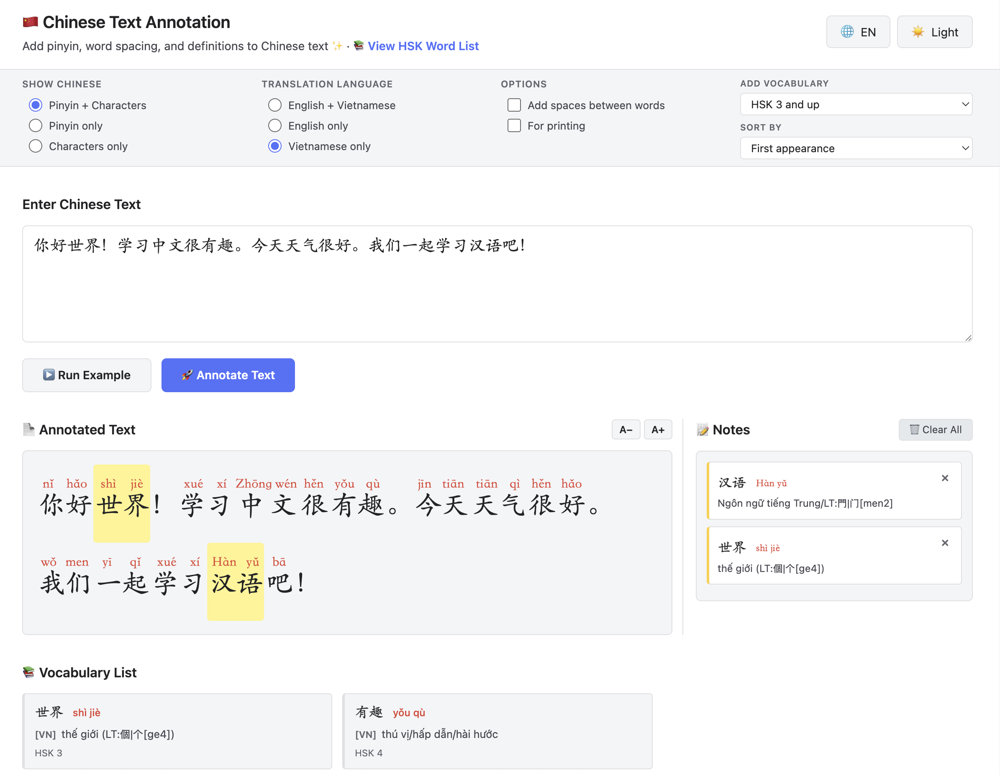

# Chinese Text Annotation Tool

A web-based tool for annotating Chinese text with pinyin, word spacing, and **bilingual English & Vietnamese definitions**.

**Creator:** [thaoshibe](https://thaoshibe.github.io/)

## Features

- 📝 **Text Annotation** - Automatically segment Chinese text and add pinyin
- 🌏 **Bilingual Support** - English and Vietnamese translations (240,000+ entries)
- 🔤 **Multiple Phonetic Systems** - Pinyin, Zhuyin, Wade-Giles, and more
- 📚 **HSK Vocabulary Lists** - Sortable lists filtered by HSK level
- 💡 **Interactive Tooltips** - Hover over words to see bilingual definitions
- 🖨️ **Print-Friendly** - Optimized for printing

## Quick Start

1. Start a local web server (required for dictionary loading):
   ```bash
   python3 -m http.server 8000
   # or: npx http-server
   ```

2. Open `http://localhost:8000` in your browser

3. Enter Chinese text and click "Annotate Text"

4. Hover over words to see definitions

## Dictionaries

### CC-CEDICT (Chinese-English)
- 120,000+ words and phrases
- 11,000+ individual characters
- Licensed under Creative Commons Attribution-ShareAlike 4.0

### CVDICT (Chinese-Vietnamese)
- 122,000+ words and phrases
- 13,000+ individual characters
- Maintained by [Phong Phan](https://github.com/ph0ngp/CVDICT)
- Licensed under Creative Commons Attribution-ShareAlike 4.0

## Acknowledgments

- Inspired by [MandarinSpot's Chinese Text Annotation Tool](https://mandarinspot.com/annotate)
- English dictionary data from [CC-CEDICT](https://www.mdbg.net/)
- Vietnamese dictionary data from [CVDICT](https://github.com/ph0ngp/CVDICT)
- HSK vocabulary data from [complete-hsk-vocabulary](https://github.com/drkameleon/complete-hsk-vocabulary)

## License

This tool is for educational purposes. Dictionary data licensed under Creative Commons Attribution-ShareAlike 4.0.
